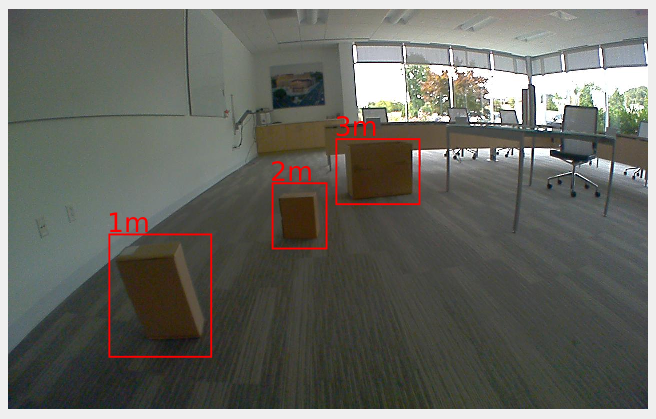
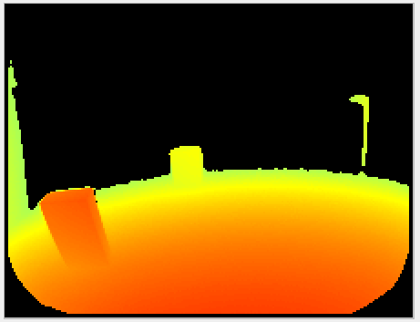
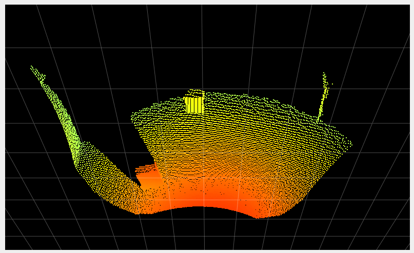

# Modes

## Description

The O3R has the specificity to provide several measurement ranges. A distance measurement is computed only for a subspace of the scene. Elements *fully* outside of the range are not taken into account and have no impact on the measurement (for instance by causing artifacts like [stray-light](../Filter/strayLight.md) or Multi-Path Interference(*coming soon*)).

>Note: Objects *very* close to the beginning or end of the measurement range can still have an impact on the measurement.

By default, the O3R provides two measurement ranges: two meters and four meters. These ranges use different frequencies to perform the Time-of-Flight (ToF) measurement and therefore show different characteristics, especially in how they are affected by artifacts. The four-meter mode shows higher noise levels than the two-meter mode (around twice as much).

## Example

Let’s look at a simple scene: three boxes are placed in front of the camera, one, two, and three meters away (see image below).

The table below shows the computed distance measurement in the distance image view and the point cloud view with the two modes available by default:

| Mode| Distance Image| Point Cloud|
|--|--|--|
| 2 m| | |
| 4 m| | |

The third box, which is three meters away from the camera, is outside of the measurement range when using the two-meter mode; however it is visible when using the four-meter mode.

> Note: Using the [offset](offset.md) parameter in combination with the mode is interesting and allows for a lot of flexibility in using the coded modulation ToF technology. We encourage you to investigate strategies using multiple modes in combination with offsets (see our application note (*coming soon*) on the topic).

## Related Topics
+ [Offset](offset.md)
+ [Basic concepts](../basicConcepts.md)
